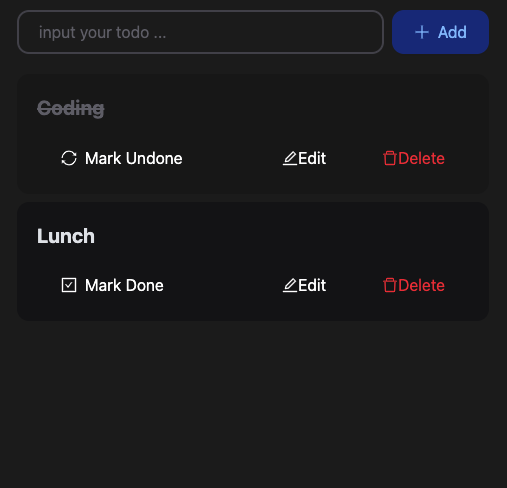

# my-todo-list-frontend

This is the repo for the react static web part of the My Todo App. The repo for the backend is [here](https://github.com/addisonchan/my-todo-list-backend), and the spec of the API called by this frontend is [here](https://github.com/addisonchan/my-todo-list-service-pact)

## Overall Tech Design

This is the diagram of the overall tech design.

  

The source of the diagram is [here](https://github.com/addisonchan/my-todo-list-service-pact?tab=readme-ov-file#overall-tech-design).

## Prerequisites

To set up the front end app at a machine, the follow(s) must be needed first:

- Install [NodeJS](https://nodejs.org/en) (Recommended version is 18)
- Run the [Todo App Backend](https://github.com/addisonchan/my-todo-list-backend)

## Setup

Here are the steps to set up the front after the prerequsistes above are fulfilled.

**1. Install all the node modules**  
Run `npm install --force`

**2. Build the app**  
Run `npm run build`

**3. Serve the app**  
Run `npm run preview`  
Or `npm run preview --host` if we want the site exposed to other machines

**4. Access the frontend web page**  
The url of the web page is shown at the command prompt after running the above command, e.g.:  
  

## Features and Screenshots

When you access the frontend url, you will see the web page as:  
  

If you start the app from scratch or without any todo item, you will see this:  
  

The red "Delete" button let you delete any todo item. You can add more todo by inputting the todo text on the top text field and click the "Add":  
  

You can also mark "Done" or revert it to "Undone" by the Mark Done/Undone at the left:  
  

If you want to edit the text of any todo item, click edit and update the text as:  
  

Last, if there is any error due to calling the backend, the page will show something as:  
  
You will then need to try to reload once the backend is up and running again.

## Development Environment

To enable frondend development can be done without being blocked by the backend implementation, a API spec is set up first. The details of the API spec can be found in [this repo](https://github.com/addisonchan/my-todo-list-service-pact)

During the frontend development, the developer can point their dev local machine to a mock API service at Swagger. However, there is a **rate limiting constraint at Swagger**. Thus, don't call the mock service repeatedly in very few seconds.

The API url for development is in [this dotenv file](./.env.development), while the production dotenv file is [another file](./.env.production).

There are some commands for development:

- Run frontend by pointing to the Swagger mock service:
`npm run dev`
- Unit Test:
`npm run test`
- Lint Check:
`npm run lint`
